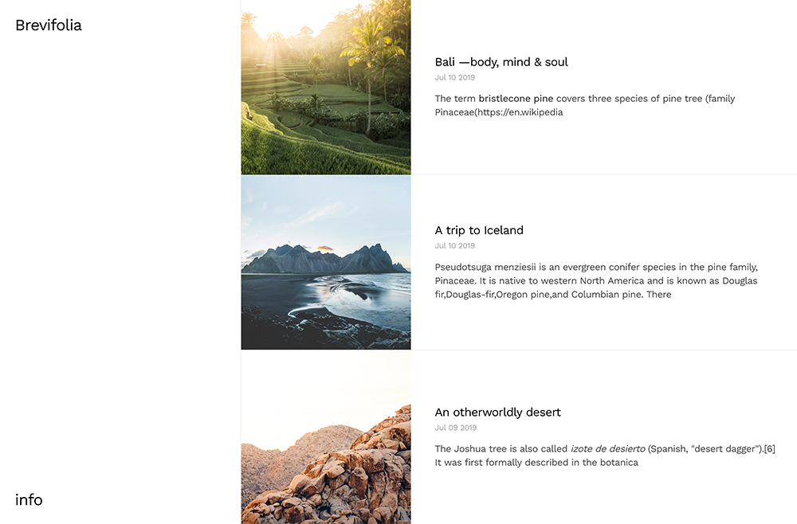

<p align="center">
  <a href="https://www.nextjs.org/">
    
  </a>
</p>
<h1 align="center">
  Brevifolia
</h1>

> 04.01.2020: Repo was updated to use latest changes from [Next 9.3](https://nextjs.org/blog/next-9-3#next-gen-static-site-generation-ssg-support). Data fetching now uses `getStaticProps` & `getStaticPaths`.



## About

Brevifolia is a minimalist blog starter to get you going with [Next.js](https://nextjs.org/).

This blog is statically generated by Next.js, a rendered combination of react components and markdown / json files. The styles were coded & designed by yours truly, using [styled-jsx](https://github.com/zeit/styled-jsx) (which is inherently supported by [Next.js](https://nextjs.org/docs#built-in-css-support)). The font used is [Work Sans](https://fonts.google.com/specimen/Work+Sans). Photography from [Unsplash](https://unsplash.com/).

## Quick Setup

#### _Set-up Locally_

In your terminal, navigate to where you would like this blog to live, then run

```bash
#clone the repo
git clone git@github.com:kendallstrautman/brevifolia-nextjs.git

#navigate to the directory
cd brevifolia-nextjs

#install dependencies & run dev server with yarn
yarn install
yarn develop

```

This will start a dev server, navigate to localhost:3000 to check it out.

## Project Structure

- Site-level configuration is stored in `data/config.json`.
- Edit styles within each component or page file within the `<style jsx>` tags.
- Global styles live in the `Meta` component.
- `posts/`contains all your markdown blog posts.
- `static/` is where you images live and will get uploaded.
- `pages` is where you page components live.
- The blog pages are dynamically generated with a `slug` parameter. See the template in `pages/blog/[slug].js`.
- The pages & template are comprised of components from `components`.
- The routes are generated at the page level, with the dynamic blog routes being generated by `getStaticPaths` in `pages/blog/[slug].js`.

## Deploy Options

[](https://vercel.com/import/project?template=https://github.com/kendallstrautman/brevifolia-nextjs)

[Vercel](https://vercel.com/docs/v2/introduction) is a cloud platform for static sites and Serverless Functions. It enables developers to host JAMstack websites and web services that deploy instantly, scale automatically, and requires no supervision, all with no configuration.

**To easily deploy this starter, click the button above.** You may need to create an account with Vercel and configure your git repository access preferences. For the deploy configuration settings, just use _all the default_ commands provided by Vercel.
